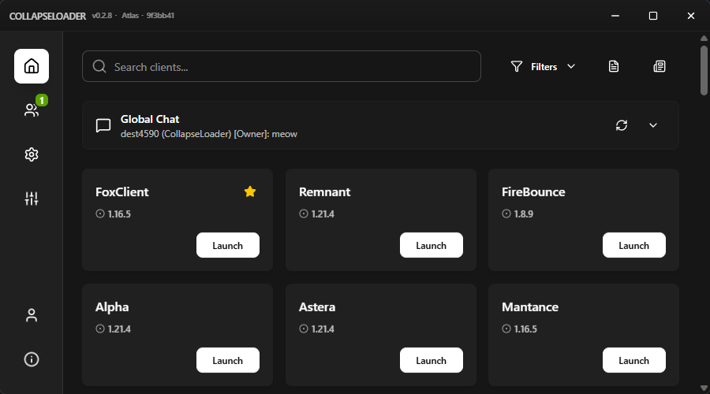
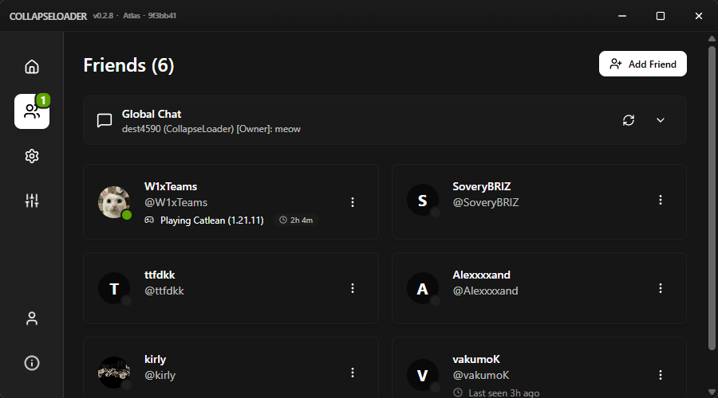
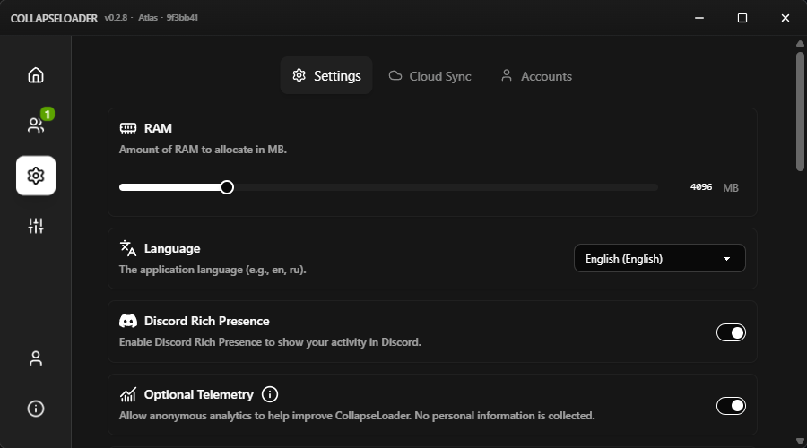
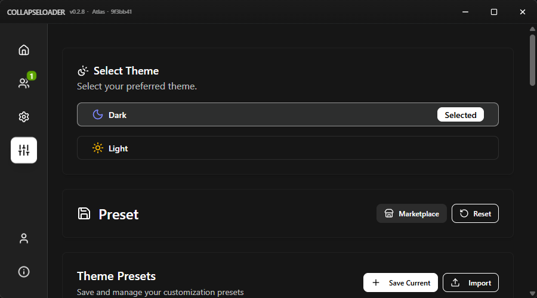
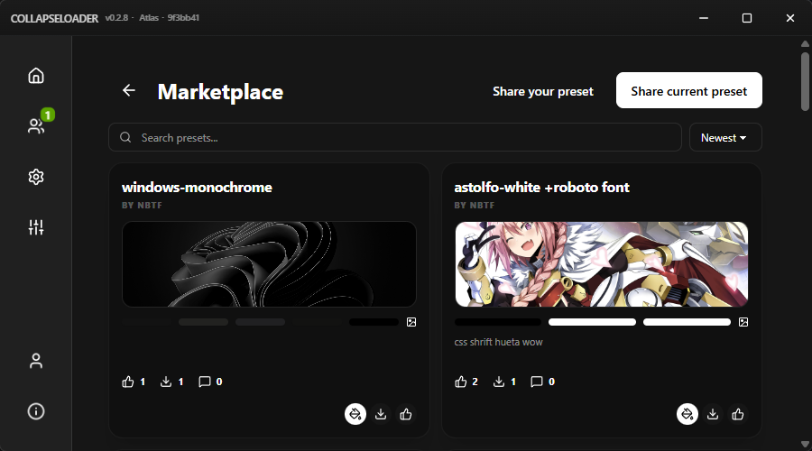
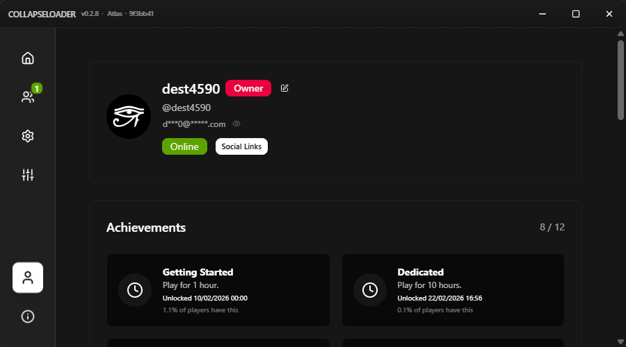
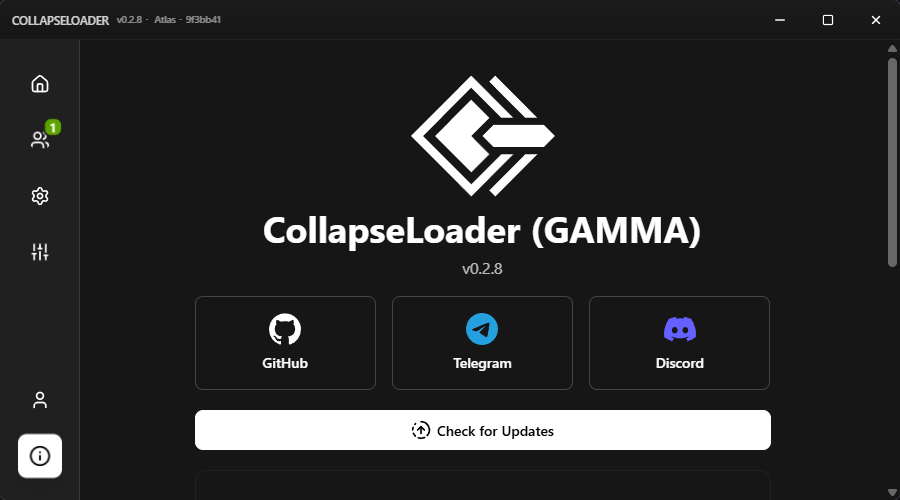

<div align="center">
  
  <h1>CollapseLoader Reborn</h1>

[](https://github.com/W1xced/CollapseLoader-reborn/actions)
[](https://github.com/W1xced/CollapseLoader-reborn/releases/latest)
[](https://github.com/W1xced/CollapseLoader-reborn/releases)

**A secure, open-source launcher for verified Minecraft cheat clients.**

[Releases](https://github.com/W1xced/CollapseLoader-reborn/releases) • [Issues](https://github.com/W1xced/CollapseLoader-reborn/issues) 

</div>

---

## 📑 Table of Contents

- [About](#about)
- [Key Features](#key-features)
- [Screenshots](#screenshots)
- [Installation](#installation)
    - [Windows](#windows)
    - [Linux](#linux)
    - [Linux Troubleshooting](#linux-troubleshooting)
- [Development](#development)

---

## About

CollapseLoader Reborn is a modern, cross-platform launcher built with **Rust** and **Tauri**. It provides a safe environment for launching Minecraft cheat clients on Windows and Linux.

### Key Features

- **Strict Verification** — Only clients that pass security audits are supported.
- **Cross-Platform** — Seamless performance on both Windows and Linux.
- **Social Features** — Friends, profiles, achievements, status.
- **Theme Marketplace** — Browse and apply community themes from Telegram.
- **Playtime Tracking** — Track time spent in each client.
- **Tray Launcher** — Launch clients directly from the system tray.
- **Zero Obfuscation** — Only clients with readable, reviewable code.

---

## Screenshots

<div align="center">
  
  
  
  
  
  
  
</div>

---

## Installation

### Windows

- **System**: Windows 10 or 11.
- **Download**: Grab the `.msi` installer or the standalone `.exe` from [Releases](https://github.com/W1xced/CollapseLoader-reborn/releases).

### Linux

#### Debian / Ubuntu

```bash
sudo dpkg -i collapseloader_amd64.deb
sudo apt install -f
```

#### Generic (AppImage)

```bash
chmod +x CollapseLoader.AppImage
./CollapseLoader.AppImage
```

---

## Linux Troubleshooting

### Missing Dependencies (webkit2)

**Debian / Ubuntu / Mint:**
```bash
sudo apt install libwebkit2gtk-4.1-dev
```

**Arch Linux / Manjaro:**
```bash
sudo pacman -S webkit2gtk-4.1
```

**Fedora / RHEL:**
```bash
sudo dnf install webkit2gtk4.1-devel
```

### Rendering Issues

```bash
WEBKIT_DISABLE_DMABUF_RENDERER=1 WEBKIT_DISABLE_COMPOSITING_MODE=1 GDK_BACKEND=x11 ./CollapseLoader
```

---

## Development

Requires Rust toolchain and Node.js.

```bash
git clone https://github.com/W1xced/CollapseLoader-reborn
cd CollapseLoader-reborn
npm install
npm run tauri dev
```

Build:
```bash
npm run tauri build
```
